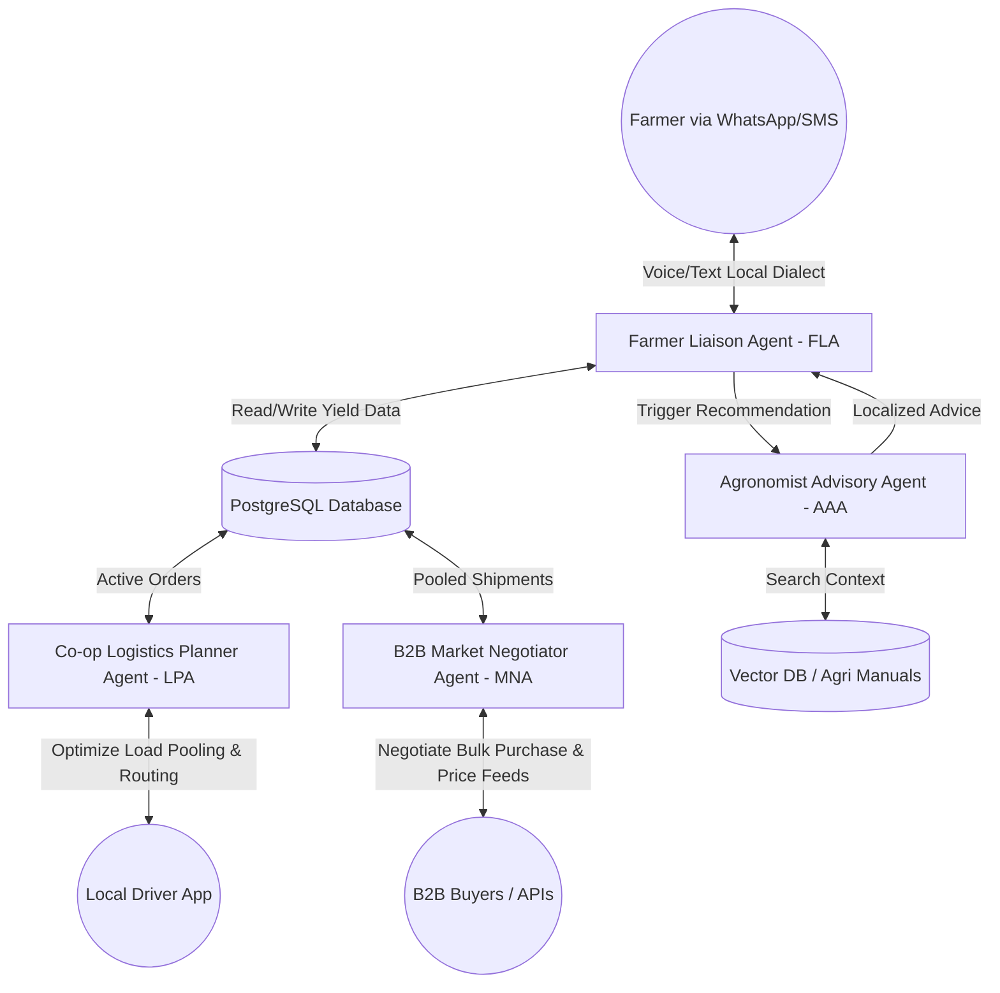
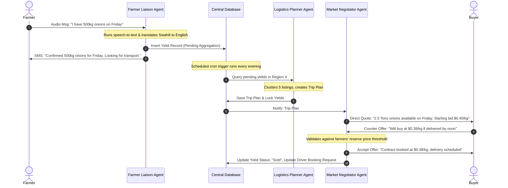

# AgriSwarms: Multi-Agent Micro-Logistics & Collective Bargaining for Smallholder Farmers

---

## 1. Project Title
**AgriSwarms** — *Decentralized Agentic Logistics & Collective Bargaining Network for Smallholder Farmers*

---

## 2. One-Line Vision Statement
Empowering smallholder farmers in developing nations to bypass exploitative middle-men and eliminate post-harvest waste through an autonomous multi-agent coordination, logistics-pooling, and bulk-negotiation network.

---

## 3. Problem Statement
In developing economies (e.g., Sub-Saharan Africa, South Asia, Latin America), **smallholder farmers** produce over 70% of the local food supply, yet they remain trapped in systemic poverty. They face three compounding challenges:
1. **Severe Post-Harvest Loss (PHL):** Up to 40% of fresh produce rots before reaching consumers due to a lack of cold storage and coordinated, affordable transport.
2. **Exploitative Middlemen ("Agents"):** Isolated farmers, lacking real-time wholesale price transparency, sell to local brokers at a fraction of market value.
3. **Inefficient Micro-Logistics:** Individual farmers trying to transport small quantities (e.g., 200 kg of tomatoes) to regional markets face prohibitive, non-viable transportation costs.

---

## 4. Why This Problem Matters
- **Global Food Security:** Reducing post-harvest loss directly increases food availability without requiring additional land or water resources.
- **Economic Empowerment:** Smallholders typically receive less than 20% of the retail price of their produce. Doubling their margins lifts entire rural communities out of poverty.
- **Climate Impact:** Food waste accounts for ~8% of global greenhouse gas emissions. Rotting food in landfills produces methane, whereas efficient distribution mitigates this footprint.

---

## 5. Target Users
1. **Smallholder Farmers:** Low-literacy, mobile-first users in rural areas who communicate primarily via local dialects and basic mobile interfaces (voice messages, SMS, or WhatsApp).
2. **Local Micro-Transport Providers:** Owner-operators of small vehicles (motorcycles, tractors, pick-ups) looking to optimize their cargo capacity and routes.
3. **Cooperative Managers / Community Leads:** Local NGO workers or co-op administrators managing regional distribution hubs using a desktop/tablet dashboard.
4. **B2B Bulk Buyers:** Wholesalers, processing plants, restaurants, and grocery chains seeking direct, traceable, and consistent sourcing of agricultural goods.

---

## 6. Proposed Solution
**AgriSwarms** replaces fragmented manual supply chains with an autonomous ecosystem of **collaborative AI agents** that coordinate logistics and aggregate market power:
- **Voice-First Accessibility:** Farmers report their upcoming harvests by sending simple voice notes in their native language (e.g., Swahili, Hindi) via WhatsApp.
- **Yield Aggregation & Dynamic Carpooling:** The system identifies nearby harvests of similar crops ripening around the same time and pools them together.
- **Automated Logistics Dispatch:** The AI matches pooled shipments with local drivers, optimizing route sequences and vehicle capacity.
- **Agentic B2B Collective Bargaining:** The system pools the crops of 50 isolated farmers into a single 10-ton bulk shipment and automatically negotiates terms with large commercial buyers, securing higher prices through collective volume.
- **Proactive RAG-Driven Advisory:** Cross-references weather patterns and soil conditions to alert farmers of local risks and offer crop preservation strategies.

---

## 7. AI Agent Architecture
AgriSwarms uses a **hierarchical multi-agent team** orchestrated using a state graph pattern (e.g., LangGraph or Google ADK workflows), enabling seamless handoffs, parallel processing, and collaborative decision-making.



---

## 8. Individual Agent Responsibilities

### A. Farmer Liaison Agent (FLA)
- **Role:** The primary human-computer interface for farmers.
- **Core Technology:** Whisper API (Voice-to-Text), LLM (Fine-tuned for localized intent extraction), Text-to-Speech (Google TTS / ElevenLabs).
- **Functionality:**
  - Receives unstructured audio notes (e.g., *"I will harvest about 4 bags of maize this Thursday. I want at least 200 shillings per bag"*).
  - Translates local dialects, extracts structured data (crop type, volume, availability date, target price), and writes it to the central database.
  - Answers farmer queries in their native tongue regarding status updates, payout confirmations, and logistics schedules.

### B. Co-op Logistics Planner Agent (LPA)
- **Role:** Fleet manager and route optimizer.
- **Core Technology:** Constraint-satisfaction logic combined with LLM planning; integration with Google Maps Distance Matrix API.
- **Functionality:**
  - Scans the database for crop listings scheduled for harvest within the same geographical zone and time window (e.g., 3-day buffer).
  - Calculates vehicle volume requirements and pools multiple micro-shipments into cohesive route loads.
  - Matches shipments with registered transport drivers based on vehicle type, location, and capacity.
  - Publishes optimized routing itineraries to drivers via SMS/Web App.

### C. B2B Market Negotiator Agent (MNA)
- **Role:** Autonomous broker and commercial sales representative.
- **Core Technology:** LLM-based negotiation loop, Web Scraping tools (Mandi price APIs, wholesale indices).
- **Functionality:**
  - Aggregates pooled inventory (e.g., "10 Tons of Potatoes") and queries active buyer listings or commodity pricing feeds.
  - Executes dynamic email/SMS-based negotiation cycles with pre-approved bulk buyers.
  - Evaluates buyer bids against historical trends and farmers' minimum price constraints to accept, counter, or reject offers.
  - Finalizes digital contracts and records transactions.

### D. Agronomist Advisory Agent (AAA)
- **Role:** Proactive yield preservation and diagnostic specialist.
- **Core Technology:** Retrieval-Augmented Generation (RAG), Weather API integration, computer vision (for crop disease photo uploads).
- **Functionality:**
  - Periodically scans regional weather updates. If a humidity/temperature spike correlates with a crop disease (e.g., tomato late blight), it triggers proactive alerts.
  - Uses RAG to query certified regional farming handbooks and pest control guidelines to generate safe, organic, and accessible treatment recommendations.
  - Evaluates uploaded crop photos to diagnose pests and recommend immediate action.

---

## 9. User Journey

```
[Phase 1: Registration & Input]
Farmer voice-messages FLA via WhatsApp: "My mangoes are ripening, ready for pick up on Monday."
FLA logs: Farmer ID, Mangoes, 300kg, Monday, Min Price: $0.50/kg.
                    │
                    ▼
[Phase 2: Aggregation & Route Optimization]
LPA aggregates Farmer's 300kg with 5 other nearby mango farmers (Total: 2.1 Tons).
LPA matches this load with Driver John's 3-ton pickup truck and maps a 5-stop pickup route.
                    │
                    ▼
[Phase 3: Automated Market Negotiation]
MNA pitches the pooled 2.1 Tons of Mangoes to 3 commercial buyers.
Buyer A bids $0.55/kg. Buyer B bids $0.62/kg but needs it by Tuesday.
MNA accepts Buyer B's bid, securing a higher return for all 6 farmers.
                    │
                    ▼
[Phase 4: Execution & Payout]
Driver John follows the AI-generated GPS map, loads the crates, and delivers them to Buyer B.
Receipt is scanned, triggering automatic mobile money payouts (e.g., M-Pesa, UPI) to the farmers.
```

---

## 10. System Workflow
The transactional orchestration ensures data integrity and transaction rollbacks in case of negotiation failures or driver cancellations:



---

## 11. Technology Stack

### Frontend (Modern Web & Mobile-Responsive)
- **Framework:** Next.js (React) styled with **TailwindCSS** and **shadcn/ui** for a clean, glassmorphic dashboard interface (for co-op managers, bulk buyers, and logistics companies).
- **State Management:** Zustand for lightweight, fast state sync.
- **Maps Integration:** React-Leaflet / Google Maps Javascript SDK for real-time visualization of truck routes and farm collection points.

### Backend & AI Orchestration
- **Runtime Environment:** Python FastAPI (highly optimized for async I/O and ML framework compatibility).
- **AI Agent Framework:** LangGraph or Google ADK (for structured agent pipelines, loops, and state memory).
- **Core LLM:** Google Gemini 1.5 Pro (Large context window to hold multi-day negotiation transcripts, multi-modal capabilities for crop disease image analysis, and cost-effective API rates).
- **Speech processing:** Whisper API (Voice transcription) + ElevenLabs (high-fidelity local voice generation).

### Database & Vector Search
- **Primary Database:** PostgreSQL (relational storage for users, crop listings, trips, transactions, and geolocations via PostGIS extension).
- **Vector Database:** pgvector extension (keeps system architecture consolidated; stores embedded agricultural documents for RAG).

---

## 12. Database Design

```sql
-- Farmers & Users Table
CREATE TABLE users (
    user_id UUID PRIMARY KEY DEFAULT gen_random_uuid(),
    name VARCHAR(100) NOT NULL,
    phone_number VARCHAR(20) UNIQUE NOT NULL,
    role VARCHAR(20) CHECK (role IN ('FARMER', 'DRIVER', 'COOP_MANAGER', 'BUYER')),
    preferred_language VARCHAR(10) DEFAULT 'en',
    geo_location GEOGRAPHY(Point, 4326),
    created_at TIMESTAMP WITH TIME ZONE DEFAULT CURRENT_TIMESTAMP
);

-- Crop Yield Listings
CREATE TABLE yield_listings (
    listing_id UUID PRIMARY KEY DEFAULT gen_random_uuid(),
    farmer_id UUID REFERENCES users(user_id),
    crop_name VARCHAR(50) NOT NULL,
    quantity_kg NUMERIC(10, 2) NOT NULL,
    harvest_date DATE NOT NULL,
    reserve_price_per_kg NUMERIC(10, 2) NOT NULL,
    status VARCHAR(20) DEFAULT 'PENDING' CHECK (status IN ('PENDING', 'POOLED', 'SOLD', 'DELIVERED', 'CANCELLED')),
    created_at TIMESTAMP WITH TIME ZONE DEFAULT CURRENT_TIMESTAMP
);

-- Logistics Trips Table
CREATE TABLE trips (
    trip_id UUID PRIMARY KEY DEFAULT gen_random_uuid(),
    driver_id UUID REFERENCES users(user_id),
    estimated_route JSONB, -- Array of waypoint coordinates
    total_distance_km NUMERIC(6, 2),
    status VARCHAR(20) DEFAULT 'SCHEDULED' CHECK (status IN ('SCHEDULED', 'IN_TRANSIT', 'COMPLETED', 'FAILED')),
    scheduled_departure TIMESTAMP WITH TIME ZONE
);

-- Mapping Table for Consolidated Shipments on a Trip
CREATE TABLE trip_manifest (
    manifest_id UUID PRIMARY KEY DEFAULT gen_random_uuid(),
    trip_id UUID REFERENCES trips(trip_id),
    listing_id UUID REFERENCES yield_listings(listing_id),
    sequence_order INT NOT NULL
);
```

---

## 13. APIs and External Services
1. **Twilio WhatsApp API:** Handles bidirectional text/voice communications with farmers.
2. **OpenWeatherMap API:** Provides 5-day localized forecasts to the Agronomist Agent for crop threat evaluation.
3. **Google Maps Platform APIs:** 
   - **Distance Matrix API:** Computes travel times/distances between micro-farms.
   - **Routes API:** Renders multi-stop driving directions.
4. **Mobile Money Gateway APIs (e.g., M-Pesa, UPI, Flutterwave):** Handles low-cost micro-payments directly to rural phone numbers without requiring traditional bank accounts.

---

## 14. RAG Implementation Strategy
To provide context-aware, localized agronomic advice without LLM hallucination, the **Agronomist Advisory Agent (AAA)** implements RAG:
1. **Data Ingestion:** Import PDF/Text manuals from FAO (Food and Agriculture Organization), regional agricultural extension services, and crop protection manuals.
2. **Embedding Generation:** Chunk documents (500 tokens with 10% overlap) and embed them using the `text-embedding-004` model (Google Vertex AI).
3. **Storage:** Store vectors directly inside **PostgreSQL (pgvector)**.
4. **Metadata Filtering:** Tag vectors with metadata tags like `[crop: Tomato]`, `[climate: Semi-Arid]`, and `[language: Swahili]`.
5. **Retrieval Pipeline:** When a farmer asks about a crop disease or weather event, the agent queries pgvector using cosine similarity, filtered by crop type and region, ensuring localized, highly relevant context is injected into the LLM prompt.

---

## 15. Key Features
- **Zero-App Farmer Interface:** Farmers interact purely through voice over WhatsApp/SMS. No internet or smartphone required.
- **Dynamic Logistics Grouping:** Auto-clusters pick-ups to minimize carbon footprint and empty truck returns.
- **Autonomous Price Negotiation:** The broker agent conducts asynchronous bidding rounds to find the highest bidder.
- **RAG Pest & Weather Safeguard:** Proactively alerts communities of heavy rainfall or sudden pest outbreaks, providing organic remedies.
- **Interactive Co-op Map Dashboard:** Visual interface displaying active yields, truck locations, pending deals, and regional price trends.

---

## 16. Unique Innovation
The major shift from traditional "agricultural information boards" is **Agentic Agency**. AgriSwarms doesn't just *tell* the farmer the price of tomatoes in the city; it **actively aggregates their crop with neighbors, hires a truck, bargains with the buyer, and deposits the money into their phone.** It takes action on their behalf.

---

## 17. Social Impact Metrics
- **Post-Harvest Waste Reduction:** Measure the percentage decrease in spoilage rates among participating farms (Target: < 10% waste, down from 40%).
- **Farmer Income Increase:** Compare crop sale prices secured by the B2B Market Negotiator Agent vs. historical local broker prices (Target: +25% net income).
- **Logistics Savings:** Tracking cost-per-kg of transportation when pooled vs. independent delivery.
- **Carbon Footprint Reduction:** Reduction in total transportation kilometers driven due to route optimization.

---

## 18. Scalability Strategy
- **Low-Bandwidth Optimization:** Keeping client-side data transmission minimal. Voice processing occurs in the cloud. SMS fallback works when cellular data (3G/4G) is unavailable.
- **Multi-Dialect Translation:** Using localized speech-to-text models that can interpret phonetic combinations of regional dialects (e.g., Sheng, Hinglish).
- **Federated Co-ops:** The software can be packaged as a Docker container, allowing individual village cooperatives to self-host their own nodes while sharing a federated buyer network.

---

## 19. Security and Privacy Considerations
- **Farmer Data Privacy:** Location coordinates are masked. Buyers only see general pickup zones (e.g., "District 4 Hub") until a sale is locked.
- **Financial Compliance:** Integration with certified payment aggregators (Stripe, Flutterwave, M-Pesa) ensuring KYC/AML compliance is handled off-platform.
- **System Safeguards:** Strict price floors set by the farmer cannot be overridden by the negotiation agent, preventing bad deals in volatile markets.

---

## 20. Deployment Architecture
Designed to fit under cloud-free tiers or low-cost student budgets for the hackathon, then scale onto enterprise cloud resources:

- **Frontend Hosting:** Vercel (Next.js SSR/Static generation).
- **Backend Host:** Render or Railway (FastAPI, Python).
- **Database:** Supabase (Managed PostgreSQL, PostGIS, pgvector).
- **Task Queues:** Celery with Redis (handles asynchronous negotiation cron jobs, SMS alerts, and batch route calculations).

---

## 21. Demo Scenario (For Hackathon Judges)
1. **Interactive Demo:** Show a live mobile phone screen running WhatsApp alongside the web dashboard.
2. **Farmer Input:** The presenter sends a voice note to the Twilio number: *"I am Rajesh. I have 400kg of potatoes ready in Alwar on Monday. Looking for 12 rupees per kilo."*
3. **Dashboard Update:** In real-time, the web dashboard updates. A new marker appears on the map, showing Rajesh’s farm, his yield, and the extracted data parsed by the **FLA**.
4. **Logistics Match:** The dashboard shows the **LPA** automatically combining Rajesh’s harvest with two other mock farms in the same village into a single truck route.
5. **Simulated Negotiation:** Click a button to trigger the **MNA**. The screen shows a live chat/email transcript where the agent pitches the 1.5-ton aggregated harvest to "Safal Markets," rejects an initial low bid, and accepts a bid of 14 rupees/kg.
6. **Agronomist Alert:** Show a simulated weather warning. Because Alwar expects heavy rain, the **AAA** automatically texts the farmers instructions on how to cover and stack their harvests to avoid moisture rot.

---

## 22. Future Roadmap
- **Phase 1 (Hackathon MVP):** Farmer voice-input, database logging, basic routing logic, mock B2B buyer negotiation simulator.
- **Phase 2 (1-3 Months):** Integrate real-time payment gateway, live Google Maps route tracking, and WhatsApp sandbox deployment.
- **Phase 3 (3-6 Months):** Pilot project with a cooperative of 100 farmers in Rajasthan, India or Rift Valley, Kenya.
- **Phase 4 (6+ Months):** Micro-financing integration—using farmers’ agentic transaction logs as a verifiable credit score to secure low-interest loans.

---

## 23. Elevator Pitch
*"Every single day, rural farmers in developing countries watch up to 40% of their crops rot in the sun simply because they can't afford a truck. Meanwhile, middlemen exploit their isolation, buying what remains for pennies. AgriSwarms changes this. By deploying a team of specialized AI agents, we give these farmers a collective voice. Our system automatically captures harvest details through simple voice notes, pools nearby crops to share truck space, and negotiates bulk pricing directly with large commercial buyers. AgriSwarms moves the farmer from isolation to collective market power, turning waste into wealth with nothing more than a basic mobile phone."*

---

## 24. Hackathon Presentation Outline
- **Slide 1: The Rotten Truth (0-30s):** High-impact visuals of dumped produce. Frame the economic and emotional toll of post-harvest loss on a single farmer (e.g., "Meet Rajesh").
- **Slide 2: The Co-op Bottleneck (30-60s):** Why current solutions (chatbots, web portals) fail—literacy issues, lack of smartphones, and manual coordination overhead.
- **Slide 3: Introducing AgriSwarms (60-90s):** Introduce the multi-agent system. Show the architectural map.
- **Slide 4: Live Demo (90-180s):** 
  - Send the WhatsApp voice note.
  - Show the Web Dashboard map update.
  - Show the agents negotiating in real-time.
  - Trigger the proactive weather alert.
- **Slide 5: Business Model & Scalability (180-210s):** Financial sustainability (small commission on B2B transactions), localized deployment, and low operational overhead.
- **Slide 6: Team & Roadmap (210-240s):** Skills breakdown, readiness to build, and deployment-readiness.

---

## 25. Why Judges Will Like This Project
1. **Moves Beyond Chatbots:** It uses AI for **coordination, optimization, and action**, not just conversation.
2. **Deep Empathy for Target Users:** Understands that rural farmers do not download mobile apps; they use voice notes.
3. **Advanced Technical Composition:** Integrates RAG (pest manuals), speech translation, geospatial routing algorithms, and complex multi-agent negotiations.
4. **Direct Alignment with UN SDGs:** Addresses SDG 1 (No Poverty), SDG 2 (Zero Hunger), and SDG 12 (Responsible Consumption & Production).
5. **High Commercial Viability:** Solves a genuine supply-chain efficiency gap that logistics companies and wholesale buyers are willing to pay for.
